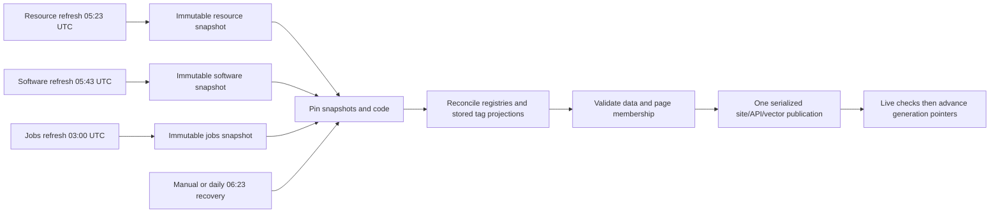

# Independent refreshes and coordinated publication

Resource, software and jobs acquisition run independently. Only the coordinated
publisher commits production data to main and deploys the site/API/search stack.
Task 50 retains contextual classification APIs; the API-free review queue is Task 51.

All three refreshes also support manual dispatch. Resource/software workflows use
existing per-request Wikidata retry limits and a 90-minute overall cap. Jobs retain
source-specific budgets, bounded parallel fetches, last-good source evidence,
manual single-source/force/dry-run controls and a 180-minute cap. A failed source
can coexist with successfully refreshed sources in one complete jobs snapshot.
Refreshes have separate non-cancelling concurrency groups. They acquire no deployment
lock and never push generated data to main.

## Embedding outages during publication

Routine publication and automatic rollback accept API/MCP text fallback only when
its reason is `embedding-error` and both reported generation IDs match the verified
catalog. This keeps a temporary query-embedding outage from rejecting otherwise
complete data. Accepted fallback is logged explicitly. Vector inventory/readiness,
page checks and generation matching remain mandatory; vector errors, missing
indexes and API failures are not accepted. Candidate vector preparation must still
succeed before Pages deployment. An exhausted quota during vector preparation can
therefore still delay a genuinely new catalog. Explicit semantic bootstrap remains
strict because its purpose is to verify semantic search itself.

## Snapshot contract and ownership

`refs/heads/dataset-snapshots/{resource,software,jobs}` point to Git commits containing
only one dataset's JSON/RDF output, its vocabulary context, and (for catalog datasets)
proposed URI reservations and legacy classifications. `snapshot.json` records schema,
dataset, generating code commit, retrieval/completion time, all file checksums,
effective content digest and immutable snapshot ID. Each new commit descends from
the previous snapshot. A fast-forward push rejects stale competing writers; never
force-push these refs. Git history is the durable retention/rollback archive, with
no dependence on expiring Actions artifacts or caches.

The publisher fetches all refs then pins concrete commit IDs once. It rejects
partial bundles, checksums that fail, stale classification evidence, duplicate
identities, unsupported schema versions and data crossing dataset boundaries.
It owns combined URI/page registries, cross-dataset recommendations, vocabulary
projections, curated assignment projections and manifests. Established URI
reservations cannot be reassigned; conflicting proposals fail with diagnostics.
Current main-branch reviewed decisions take precedence over proposed cache values.
Already-consumed snapshots do not overwrite subsequent reviewed data edits.

The first cutover uses the checked-in last-good dataset wherever no snapshot ref
exists. Thereafter refreshes hydrate their last-good inputs directly from the
independent refs; they do not wait for site publication. Jobs use those validated
catalogs to build their vocabulary. No job refresh or publication queries Wikidata.

`data/dataset-provenance.json` identifies pinned snapshots. `data/publication-inputs.json`
records effective dataset and release-code digests. Individual snapshot retrieval
ages appear in assembly logs. Retrieval timestamps may precede publication start;
the manifests retain actual source times rather than falsely claiming a new fetch.
Failure summaries remain in the originating Actions run and source diagnostics.
Age alone never blocks unrelated releases. Integrity/semantic incompatibility does.
Source evidence timestamps are never renewed during assembly; explicit expired
job postings become inactive in both RDF and JSON.

## Vocabulary and classification reuse

Unchanged source evidence reuses stored assessments, including completed empty
assessments, even when the vocabulary grows. Labels and catalog page links update
from stored RDF without source scraping or model calls. Compatibility checks compare
assigned identities, dimension, definition/scope and hierarchy, not a global version.
Changed meaning or removed assigned terms require explicit reviewed decisions in
`curation/tag-decisions.ttl` for rejections; accepting a changed meaning requires an exact-transition approval in `curation/tag-semantic-reviews.json`. Publication fails with the affected subject/target
rather than presenting an invalid assignment. Reviewed rejections/corrections
survive refreshes. Classification method/model/evidence-version changes and changed
source text invalidate reuse. Existing attribution remains attached to reused results.
An older human decision does not approve a later semantic change. Each transition
approval is a JSON array entry with `subject`, `target`, `fromSemantics`,
`toSemantics`, `state: "approved"`, `reviewedBy` and `reviewedAt`. The two hashes are
`shared_tags.digest(shared_tags.term_semantics(term))` for the old and new term.
Only add one after reviewing the affected source evidence. Removed targets require
rejection or replacement; a transition approval cannot resurrect a removed term.
Changes to matching policy or prompts must bump the classifier's `METHOD` (or
`EVIDENCE_VERSION` for evidence rules) to invalidate prior assessments explicitly.
A new catalog entry cannot take over an existing tag identity for the same Wikidata ID.

Legacy software-type classification and contextual classification still run on
uncached inputs. Each dataset has its own disposable response cache, with accepted
assessments also recovered from durable RDF on a cache miss. Do not clear the cache
as a substitute for fixing evidence or compatibility failures.

## Publication and recovery

Every trusted refresh completion requests assembly, even if some source operations
failed. Manual/code-only releases and daily recovery use saved data. Effective
content comparison deduplicates requests before any deployment or vector/API
mutation. Code changes participate in that comparison. The deployment queue never
interrupts an active release; arrivals during a deployment request a follow-up
that pins the newest refs when it starts. Redundant queued requests become no-ops.
A concurrent main-branch update makes the normal fast-forward commit push fail;
no rebase or force-push mixes unvalidated code into a pinned generation. Dispatch
publication again on current main to retry.

Publication retains exact-commit API deployment, generation-specific vector
readiness checks, Pages checks, atomic generation-tag advancement, automatic
failure rollback and manual `deploy.yml` rollback. Never retarget immutable
`catalog-generation/*` tags. Rolling back changes production pointers, not dataset
snapshot history. A subsequent publication can retry the latest snapshots.

Recovery steps:

1. Inspect the failed refresh or publication phase, snapshot IDs and source counts.
2. Retry only the affected refresh (jobs can target a source). Last-good refs remain
   usable while failures are investigated. Successfully cached classifications survive.
3. For a vocabulary incompatibility, review affected assignments and commit the
   maintained vocabulary/decisions; do not bypass the compatibility check.
4. Dispatch `Publish Catalog Generation` to retry assembly/deployment from saved data.
   The explicit semantic initialization input remains available for search repair.
5. For a production regression, dispatch `deploy.yml` with the previous immutable
   generation. Confirm site/API/vector generation consistency before another release.

## Work reuse and diagnostics

Cross-dataset related links are computed once by the publisher, not by each
independent refresh. HTML is rendered once after final membership and tag-link
projection, and byte-identical pages are retained. Vector generation seeding remains
unchanged: ready generations are reused by `vectors:ensure`; a genuinely new
release gets its own verified namespace. Reusing embeddings across different
namespaces is deliberately deferred until its invalidation and consistency can be
proved. There is no second indexing pipeline introduced by the split.

Actions records each acquisition/classification/build/deploy phase duration.
Snapshot CLI phases additionally emit elapsed seconds; classification reports
processed/uncached/reused records; page generation reports generated/reused counts.
See `audits/task50/README.md` for measured baseline, targets and verification evidence.

## Temporary embedding pause (2026-09-25)

`EMBEDDINGS_PAUSED=true` is set in both publication workflows and the API Worker configuration. Publication continues with verified catalog files and API/MCP text search against the current catalog. Query embeddings, vector provisioning/seeding, vector readiness checks and pruning are paused. Existing vectors and readiness records are retained; an older vector generation is reported truthfully and is not used to answer searches for the newer catalog.

To resume, remove the pause from both workflows and `api/wrangler.toml`, then prepare and verify vectors before enabling semantic publication again. The pause does not claim that the new catalog has matching vectors.
